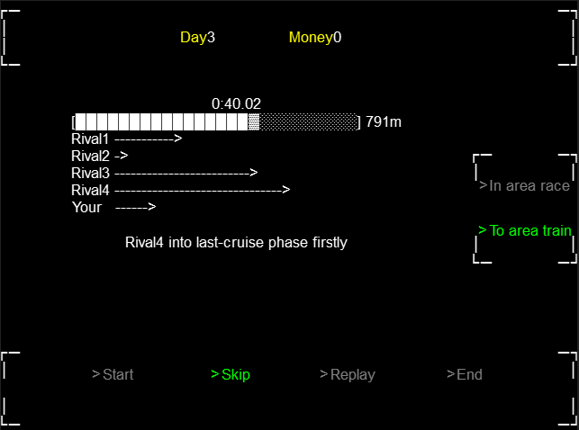
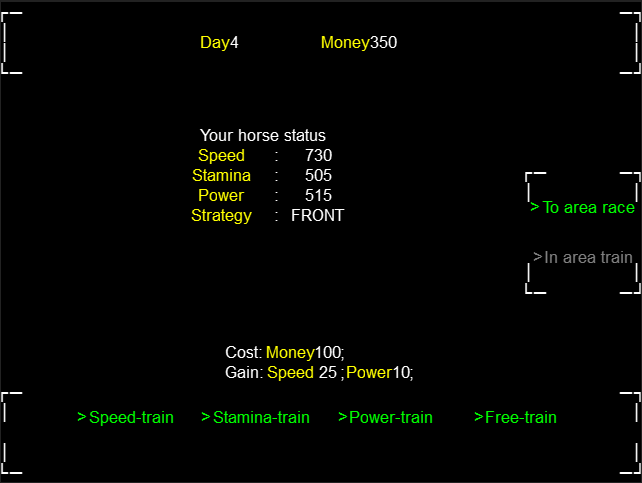

This project created in [Everything is text Jam 1](https://itch.io/jam/everything-is-text-1/rate/1659803). Use game engine `libgdx`.

## TextUma

Horse management and racing simulation game. 

The schedule is given. In the train-day, you can train your horse for improving its speed, stamina and power. In the race-day, your horse will run with rivals and win prize for you. The race's process will show as a text-base animation.

**In this demo version,** the schedule is designed simply and there is no specific goal of the game. Just shows how the horse's abilities affect the race's process and result.

### run

Desktop: Run desktop-subproject java main.

Web: [Online play](https://hundun.itch.io/textuma)

### How to play

Use mouse click the green textbox which is means a button. 

### game logic details 

- target-speed & current-speed & acceleration: The target-speed determines by a function of  the race-phase and horse status. When target-speed changes, the current-speed will tend to it with an determined acceleration.

- stamina-point: The stamina-point determines by a function in the start of a race, and is consumed in the process. The consume rate is a function of the current-speed and horse status.

- run-strategy: Give different coefficients to the target-speed function. For example, the FIRST has large bonus in the starting phases, while the tail has large bonus in the ending phases. 

- sprint: In the sprint phase, the horse will try to use all its remaining stamina-point for a larger target-speed and a longer sprint phase length. It's a good chance for changing the situation.

- Speed: Mainly affect the target-speed by giving coefficients to the function. 

- Stamina: Mainly affect the stamina-point by giving coefficients to the function. 

- Power: Mainly affect the acceleration by giving coefficients to the function. 

**demo version tips**: There may be something unbalanced with the functions and coefficients, which perhaps makes a run-strategy has too much bonus or a horse status looks  useless.

### project details 

The racing logic is from subproject [umamusume-simulation](https://github.com/hundun000/umamusume-simulation). The management logic is designed for the TextUma project.

